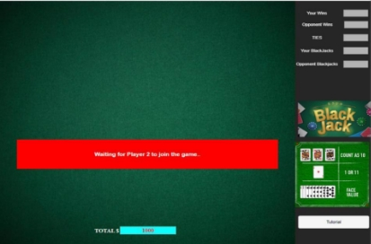
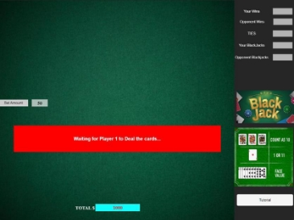
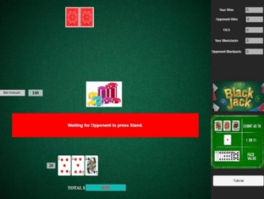
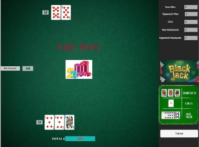
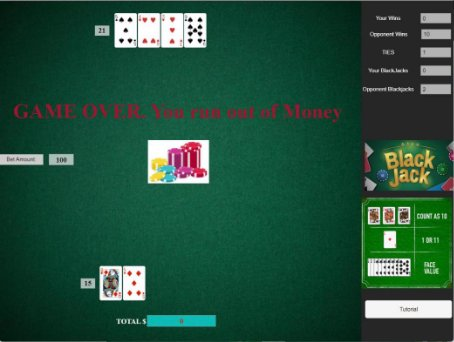
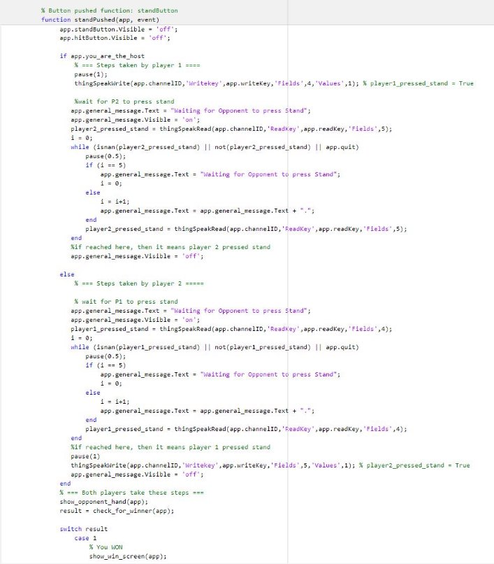
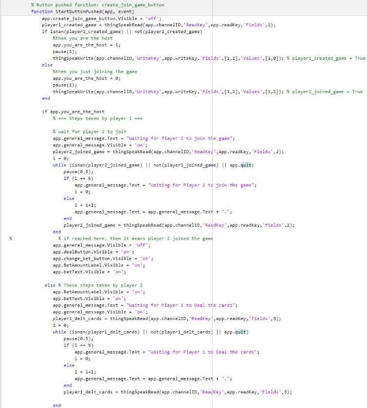
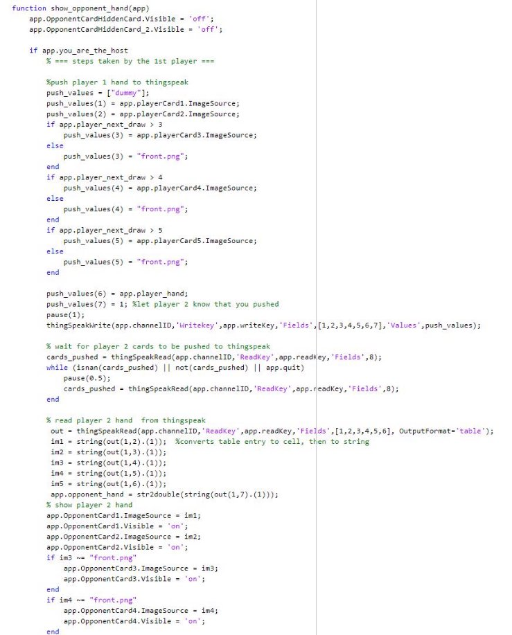
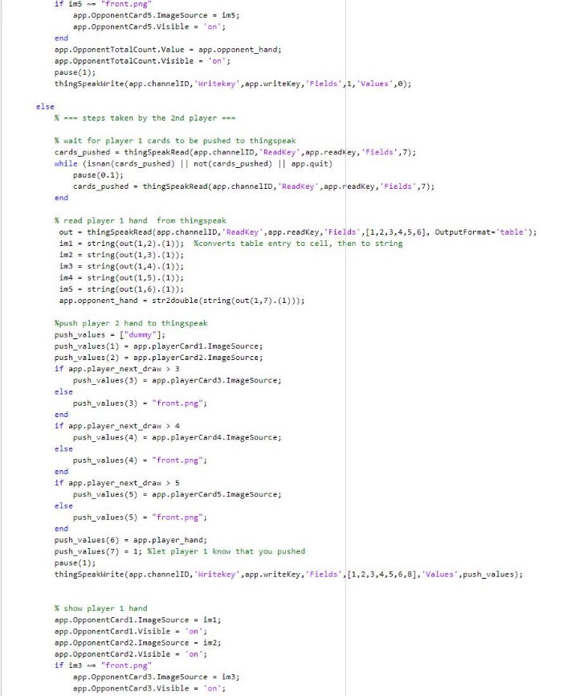

# Introduction

Blackjack is a popular card game. The objective of the game is to have a hand with a higher total value than the other player/dealer, without going over 21. Each player is dealt two cards, and can then choose to "hit" to receive additional cards or "stand" to keep their current total. If playing against the dealer (ie singlePlayer mode), then the dealer also receives two cards, with one facing up and one facing down. The dealer must hit until their hand has a value of at least 17. A player wins if their hand is closer to 21 than the dealer's, or if the dealer goes over 21, known as "busting." Each card is worth its face value from 2 to 10. Ace’s are worth either 1 or 11, whatever is favorable for the player’s win condition. Face cards (king, queen, jack) are worth 10. An automatic win (blackjack) occurs when a player or dealer draws an ace and face card during the start 

## Game Play 

Upon launching the application, there will be home screen music playing with two buttons in the middle of the screen one for single-player and the other for multiplayer. 

After clicking on multiplayer, the player will be greeted by a start button. Whoever clicks the start button first will be considered player one (i.e. the host) and a “Waiting for Player 2 to join game…” message will stay until player 2 clicks the start button from their computer.

Player 2 joining the game will result in a screen where player 1 gets to decide the amount of bet for both players with the “Change Bet” button or they can choose to immediately deal. Meanwhile, player 2 has the message “Waiting for player one to deal the cards” displayed on their screen.

Once the deal button is clicked, both players will be dealt two cards that are hidden from the other player. Players will have the option to click “Hit” to add an additional card to their hand or click “Stand” to end their turn. Players can have as many as 5 cards or if the total value passes 21, which is considered a bust. Acquiring a bust will automatically end one’s turn. 

The value of a player’s hand is displayed in the “totalCountField” next to each player's first card.

` `Whoever’s turn ends first whether that be by a bust or manually clicking stand will see the message “Waiting for other players..” until the other player ends their turn. Afterward, both player’s hand will be revealed and total count value will be compared. A player that has a higher value while under 21 will win that round, while the other loses. If both players have the same value or both bust then that will be a tie. A player will be given a post-round screen with Music that correlates to their round status, such as “YOU WIN” if the player won. After the post-round screen, the players’ stats bar and total money will be updated accordingly based on round status. 

When a player loses and reaches $0 total, a    game over screen will be displayed. To play again both players must close the application and select multiplayer mode.

## Single Player code

- FlowChart explaining The singlePlayer game flow 

**The functions:** 

**changBetPushed**: This is callback function, called whenever the player presses  “change BET” button. 

- It makes the bet text field editable so that the player can adjust the bet amount, and also reveals the “confirm New Bet” button. Is disables the “deal” button since we can’t deal unless we choose a proper bet amount 

**ConfirmNewBetButtonPushed**: this callback function, called whenever the player sets the bet amount and presses “Confirm the bet amount” button 

- It makes sure that the player entered numerical bet amount and didn’t enter just some random letters or characters 
- If bet amount is numerical, then it makes sure that the bet is no more than the total money left. It also prevents entering negative bet amounts. 
- In case player enters non-accpetable bet amount, then the bet amount will be reset to $1. Then the player either enters an appropriate bet amount or leaves the bet as $1 and continues. 

**dealPushed**: This is a callback function that is called whenever the player presses “DEAL Button” at the start of each game. 

- It draws 2 cards for the player/dealer  by calling “draw\_card” function. 
- Assigns the correct image for each card visualization 
- If player/dealer has 2 Ace’s in their hand (hence they get busted), then it will make Ace worth 1 instead 11 therefore the player/dealer won’t be busted. 

o  ACE is either worth 1 or 11, depending on which is in your favor 

**hitPushed**: This is a callback function that is called whenever the player presses the “Hit” button. 

- It draws a card by calling the “draw\_card” function, then assigns the proper image to the card visualization. 
- The game is built such that you can’t draw more than 5 cards, however, that is unlikely to happen since you will probably will be busted before having 5 cards. If you drew 5 cards and you are not busted, then your turn will end. 
- If you drew Ace and it’s make go busted, then the ace will worth 1 instead of 11 and you won’t be busted. 

**standPushed**: The is is callback function, called whenever the player presses “Stand” button. 

- Disables the stand and hit button, reveals the dealer hand then checks whether the player or the dealer won 

**NewGameButtonPushed**: This is callback function, called whenever the player presses “New Game” button. 

- it finishes the current session and starts a new session. Resets all the stats counter (win, loss, tie,etc..) 
- make the total money field adjustable, so that the player can change total money they have for the new session 

**TutorialButtonPushed**: callback function, called whenever the player presses “Tutorial button” 

- If tutorial is not visible, then it makes the tutorial visible to the player, and changes the “tutorial” button to “close tutorial button” 
- If tutorial is already visible (ie player want to close tutorial), then makes the tutorial invisible and changes the text back to “Tutorial”  

**Draw\_card**: this function draws a new card for the player or dealer 

- Choose random card from the “cardsName” file, and extracts the name and the value of the card 
- Deletes the drawn card from deck 

**Initializes**: this function is called everytime we start a new game in the given session. 

- Makes the chip image and bet text visible. 
- Plays the shuffle and deal sound 
- Makes the following entities visible: stand button, hit button, player1 cards, one of the dealer cards while the other card’s back will be shown 

**New\_game\_init**: this function is only called when a new game starts. 

- Makes sure player entered correct bet and total money, and Resets the stats (win,loss,etc..) to zero  

Update\_status: this function updates the status of player and dealer hand 

- Possible outcomes: if either the player or dealer has blackjack, then their status will be 1.  
- If player/dealer is busted, their status will be 2 
- Otherwise we assign dummy state 3 

**Check\_for\_instant\_win**: if dealer has blackjack or player is busted, then dealer won and loss screen is shown. Else if player has black jack or dealer is busted, then player won and win screen is shown 

Show\_win\_screen: called when the player won. It shows Win message and plays “YouWin” sound effect. 

Show\_loss\_screen: called when the player losses. It shows Loss message and plays “YouLose” sound effect. 

**Show\_dealer\_hand**: shows the dealer hand. 

**reset**: called whenever a game finishes.  

- If you run out of money, then it will show “game over” message and “new game” button will be visible at the center of the screen 
- Otherwise resets the visibility of game entities (player cards, dealer cards, etc..) 

## Multiplayer Code

- Flowchart explaining the Multiplayer game flow 

**The functions:** 

- **Note:** the following functions : 

(changeBetPushed, ConfirmNewBetButton, tutorialButton, hitpushed, draw\_card, new\_game\_init, intializaiton, show\_win\_screen, show\_loss\_screen, reset)  are the same as the singleplayer so we wont’ explain them here** 

**dealPushed:** The same as the single player except we added the thingspeak functionality. If you the host (ie player 1), then you the function will push total money and bet amount to things speak (field 2 and 3 respectively), and infrom the Player2 that you pressed the deal button, so that they can continue the game (since player2 was waiting for you to press the deal button) 

**standPushed**: This is callback function, called whenever the player presses the “stand” button signaling the end of their turn. 

if it’s player1, then the function does the following: 

- Let player2 know that you pressed stand by pushing to thingspeak 
- Wait in while loop for player2 to press stand by consistently checking the thingspeak for changes 
- While waiting it’s does show dots animation to indicate to the player that the screen is not freezing 

If it’s player2, then function does the following: 

- Wait in while loop for player1 to press stand by consistently checking the thingspeak for changes + do dots animation 

After that the function does the following: 

- After both player pressed stand, reveal the hands by calling “show\_opponent\_hand” function, and check for winner by calling “check\_for\_winner” function. 
- Show the win or loss screen, then start a new game by calling reset function 

**StartButtonPushed**: this is callback function, called whenever the player presses the “START” button at the beginning of the game. 

- Hide the “START” button 
- Whoever clicked the start first will be the player1 (ie the host). Player1 will push to thingspeak “player1\_create\_game = True”  by setting “field 1” to value 1, then the player1 will be waiting in a while loop for player2 to join. 
- If it’s player2, then the function pushes to thingspeak to inform player1 that the player2 joined the game 
- After player2 joins the game, the “deal” and “change bet” buttons will be visible to the player1. 
- player2 will be waiting in while loop for player1 to deal the cards and constantly checking thingspeak for changes. When the player1 deals the card, player2 will be informed, and exit the loop, then pull the bet amount from thingspeak, then hit and stand button will be visible to 

player2. 

**UIFigureCloseRequest**: called whenever you close the UI Figure, it resets the thingspseak fields to default state, and then deltes the app. 

**Show\_opponent\_hand**: this function pushed player cards to thingspeak, and reveals the opponent hand 

If it’s player1, then the function does the following: 

- Push player1 cards and hand value to thingspeak 
- Let player2 know that did the push to thingspeak 
- Wait for player2 cards to be pushed to thingspeak 
- Then read player2 cards and hand value 
- Show player2 hand 

If it’s player2, then the function does the following: 

- Wait for player1 cards to be pushed to thingspeak 
- Read player 1 cards and hand value from thingspeak 
- Then push player2 cards and hand value to thingspeak 
- Let player1 know that you pushed 
- Show player 1 hand 

**Check\_for\_winner**: this functions checks whether the player won (1), opponent won (2), or it’s tie (3) 
